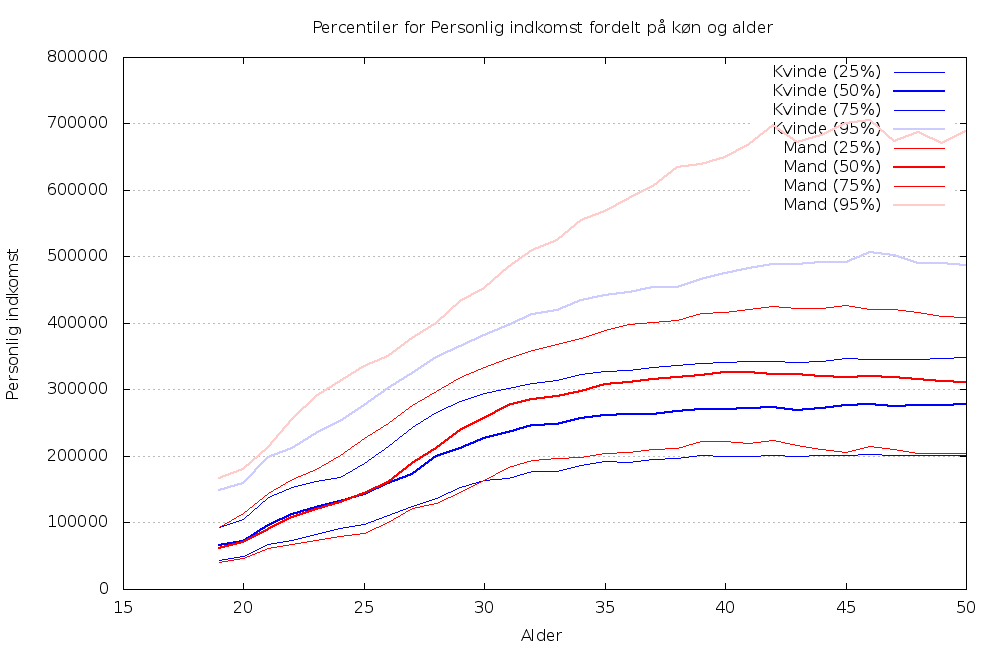
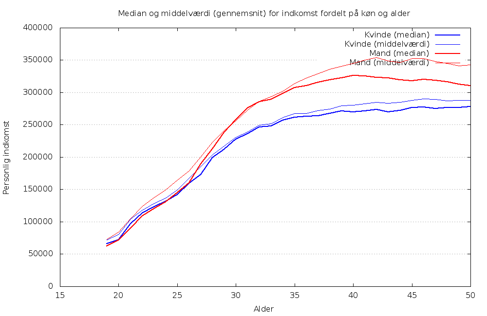
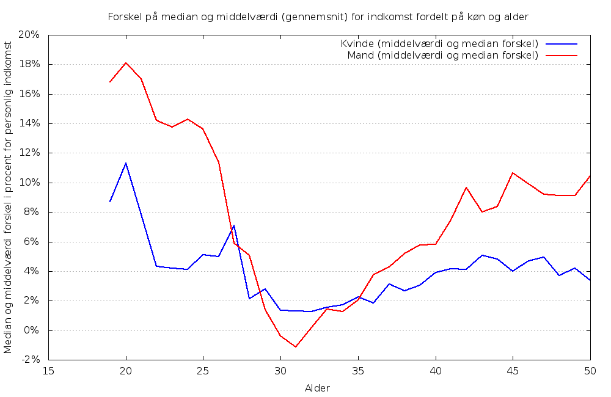

danum
=====

Creates graphs for income as a function of sex and age for danish citizens.
The graphs focus on percentiles rather than arithmetic mean (aka average).

Inspired directly by Peter Brodersen's graph at
https://plus.google.com/+PeterBrodersen/posts/J9L84KZiT37

Requirements
------------

- bash
- gnuplot

Usage
-----

- Download the data from http://skat.dk/opengovcamp/ and unpack them
- Rename "YYYYMMDD OpenGovCamp.csv" to simply "OpenGovCamp.csv"
- Execute ./indkomst.sh
- View the generated PNGs

Rendered graphs
---------------
Data collected for 2012 by SKAT (http://skat.dk/opengovcamp/).

Observations
------------

- At the high end of the pay grades (the 95% percentile), the gap between Mand (male) and Kvinde (female) is quite a lot larger than the rest of the percentiles.
- At the low end (the 25% percentile), the gap is relatively small.

To investigate
--------------
- The gaps widen around the 30 years mark. It would be interesting to see if this age point is stable when looking at statistics collected from earlier years or if it moves to the right as the calendar year gets higher. In other words: Is the income difference between the sexes getting smaller over time?

Note
----
Brutally bucketing all income by sex, age is an exercise in over simplification. When investigating inequality in income, a better approach would also involve job types.
