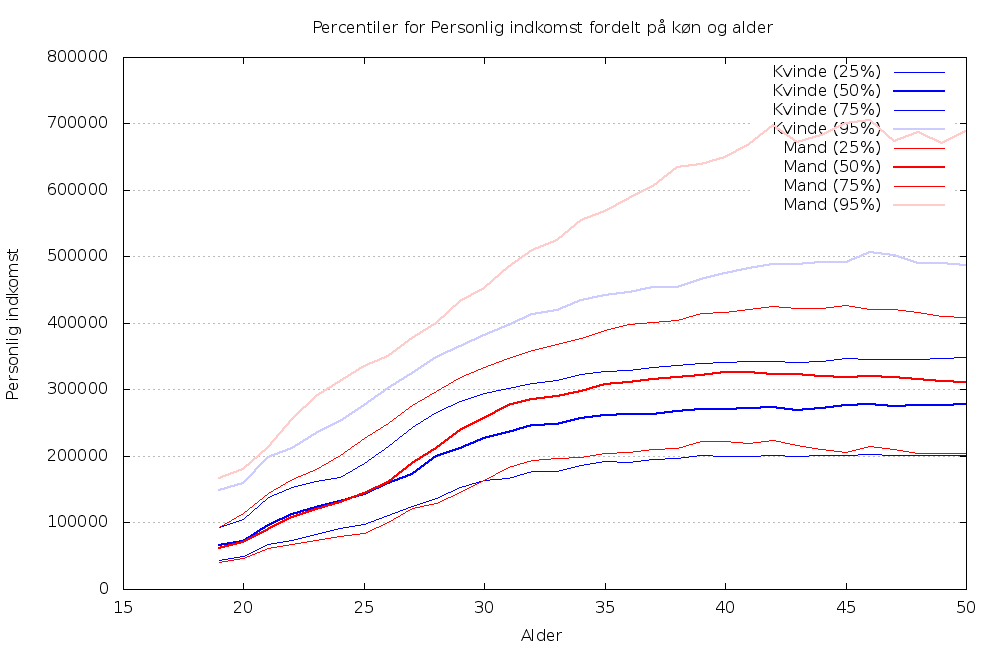

danum
=====

Graph generation from public danish statistics

This was very quickly hacked together, inspired directly by
Peter Brodersen's graph at
https://plus.google.com/+PeterBrodersen/posts/J9L84KZiT37

Requirements:
- bash
- gnuplot

Usage:
1) Download the data from http://skat.dk/opengovcamp/ and unpack them.
2) Rename "YYYYMMDD OpenGovCamp.csv" to simply "OpenGovCamp.csv".
3) Execute ./indkomst.sh
4) View indkomst.png

